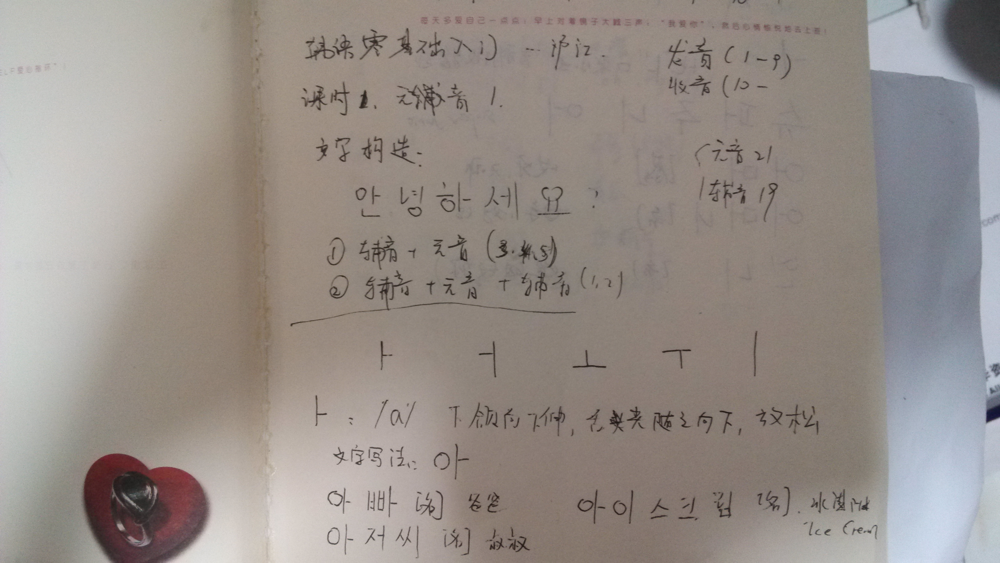
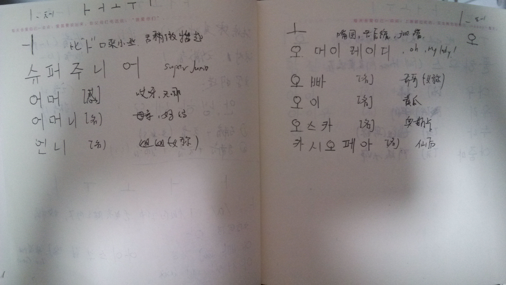
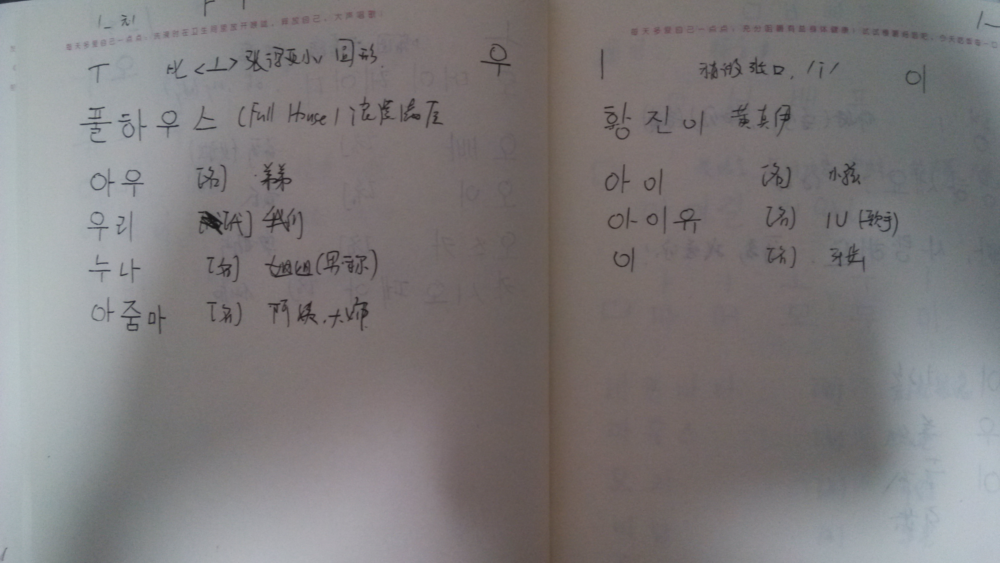
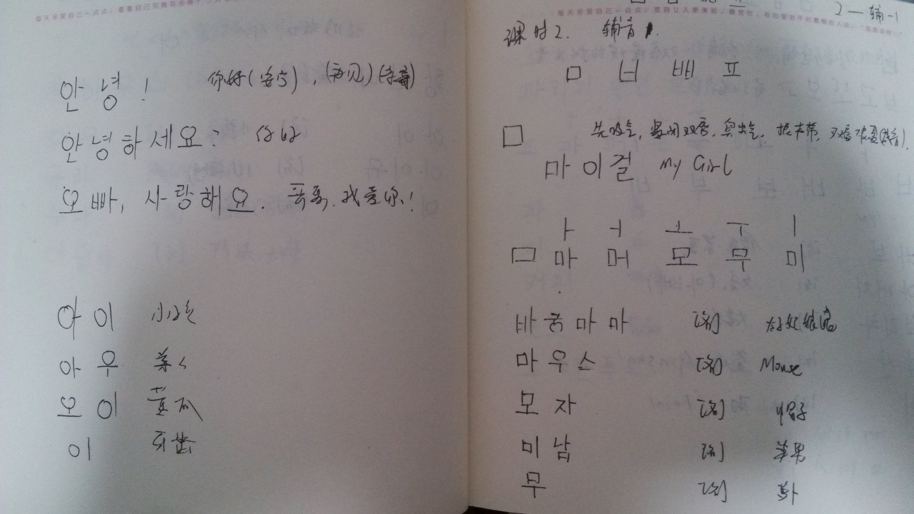

大家好，我今天开始第一个100天计划，学习 `韩语`。每天学习一点点，主要内容是我的学习笔记和课程链接等资料。今天是第一课：五个 `元音`. 

## 韩语学习第一课 (发音)-Day1

### 五个元音

ㅏ  ㅓ  ㅗ ㅜ  ㅣ .

下面是我的学习笔记:

<figure class="half">
    
    
    
    
    <figcaption>第一课，五个元音ㅏ  ㅓ  ㅗ ㅜ  ㅣ.</figcaption>
</figure>

课程链接在这里：[沪江韩语发音](http://study.163.com/course/introduction/232009.htm#/courseDetail)
-----------------------
后面会继续所有元音和辅音：

        元音:ㅏ ㅑ ㅓ ㅕ ㅗ ㅛ ㅜ ㅠ ㅡ ㅣ 
                ㅐ ㅒ ㅔ ㅖ ㅚ ㅟ ㅢ ㅘ ㅝ ㅙ ㅞ

        辅音:ㄱ ㄴ ㄷ ㄹ ㅁ ㅂ ㅅ ㅇ ㅈ ㅊ ㅋ ㅌ ㅍ ㅎ
       ㄲ ㄸ ㅃ ㅆ ㅉ

☞————————↓————————☜
<figure >
    
    <figcaption> 欢迎关注 HowieiBook, 回复“h”查看帮助</figcaption>
</figure>
