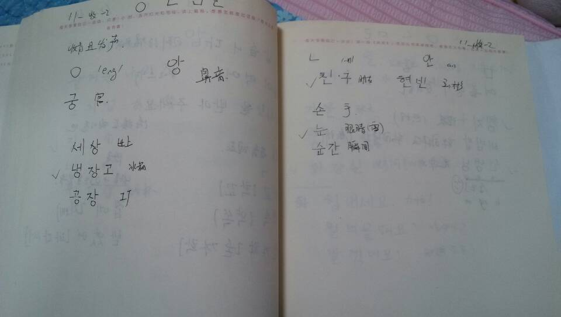
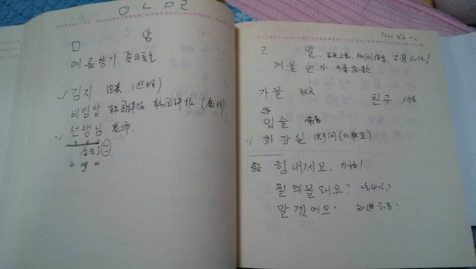
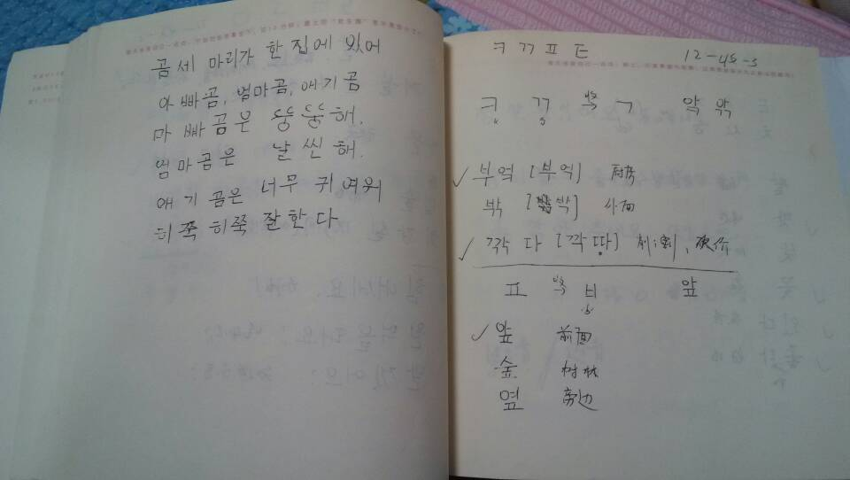
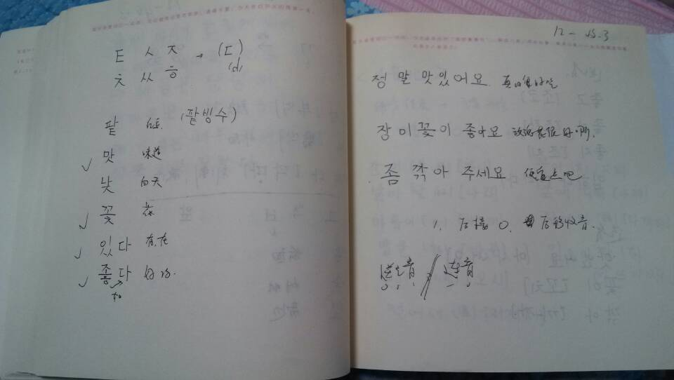

大家好，今天是我学习 `韩语`100天计划的第15天。每天学习一点点，主要内容是我的学习笔记和课程链接等资料。

今天继续发笔记吧。因为突然发现笔记这样发上来，就成了很好的随身携带的电子化笔记了，可以随时听课复习。嘿嘿！

统一调整各个笔记标题，看着应该更科学了。加油！收音这部分还是挺麻烦的！对照前面沪江的笔记一起学了。

## 韩语学习-Day15

下面是我的学习笔记:

<figure class="half">
    
    
   
    
         <figcaption>  </figcaption>
</figure>

这里就是所有元音和辅音：
---
        元音:ㅏ ㅓㅗㅜㅣ ㅑ  ㅕ  ㅛ  ㅠ  ㅒ ㅖ ㅐ ㅔ ㅚ ㅟ   ㅡ   ㅢ  ㅘ ㅝ ㅙ ㅞ

        辅音:ㄱ ㅁ ㅂ ㅇ ㅈ ㅊ ㅉ ㅅ ㅆ ㅋ ㄴ ㄷ  ㅌ ㄸ ㄹ ㅍ ㅎ
       ㄲ ㅃ

课程链接在这里：[沪江韩语发音](http://study.163.com/course/introduction/2320015.htm#/courseDetail)

-------------------------------------☞————————↓————————☜
<figure >
    
    <figcaption> 欢迎关注 HowieiBook, 回复“h”查看帮助</figcaption>
</figure>
