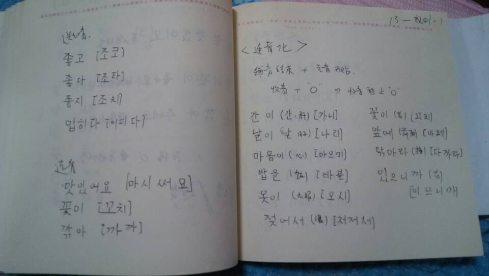
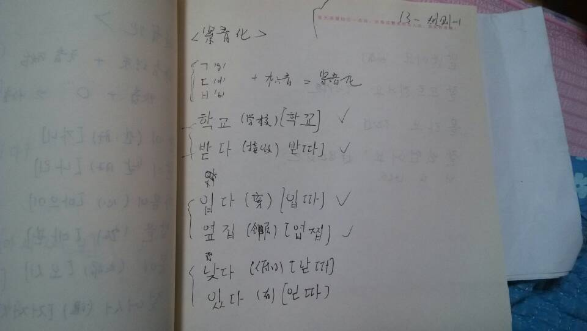
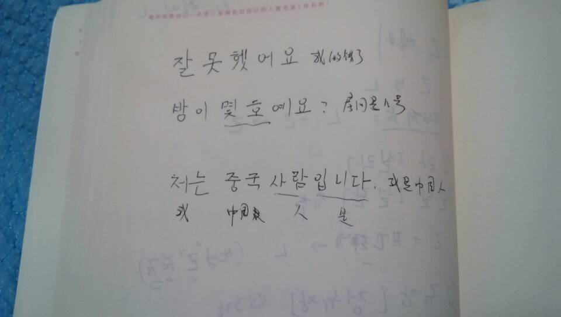
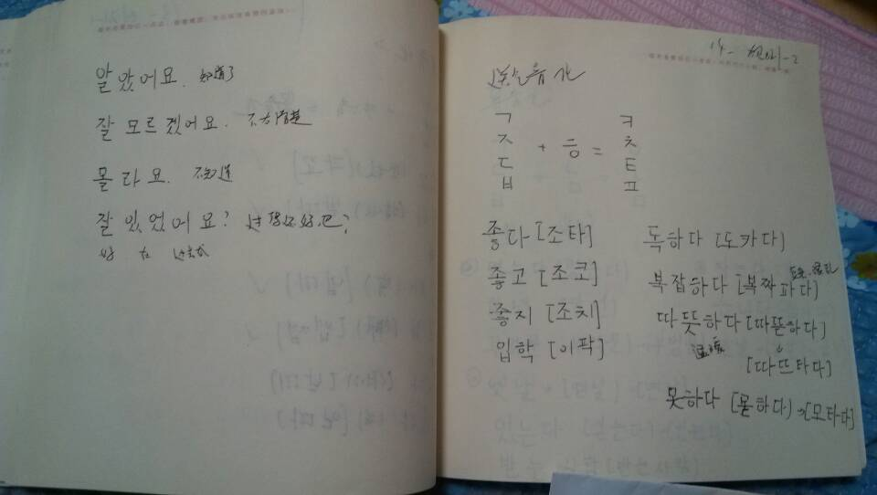
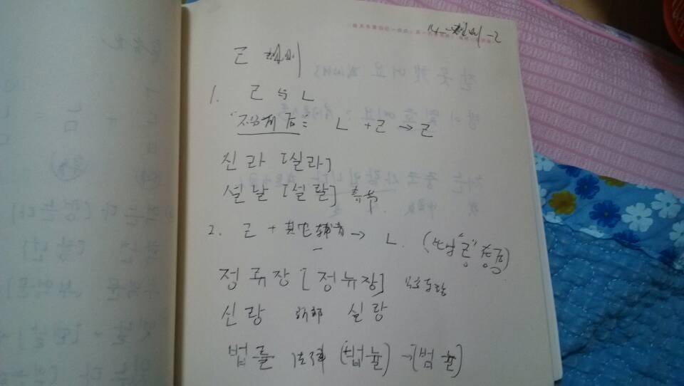
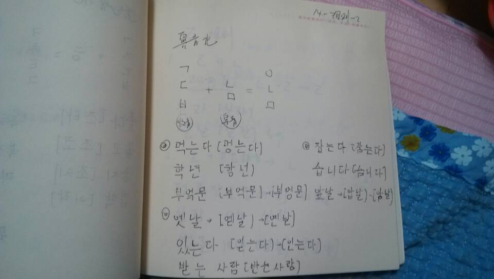

大家好，今天是我学习 `韩语`100天计划的第16天。每天学习一点点，主要内容是我的学习笔记和课程链接等资料。
发音规则是最后一部分笔记了。计划明天开始每天学一两句话。

## 韩语学习-Day16

下面是我的学习笔记:

<figure class="half">
    
    
   
    
   
    
         <figcaption>  </figcaption>
</figure>

这里就是所有元音和辅音：
---
        元音:ㅏ ㅓㅗㅜㅣ ㅑ  ㅕ  ㅛ  ㅠ  ㅒ ㅖ ㅐ ㅔ ㅚ ㅟ   ㅡ   ㅢ  ㅘ ㅝ ㅙ ㅞ

        辅音:ㄱ ㅁ ㅂ ㅇ ㅈ ㅊ ㅉ ㅅ ㅆ ㅋ ㄴ ㄷ  ㅌ ㄸ ㄹ ㅍ ㅎ
       ㄲ ㅃ

课程链接在这里：[沪江韩语发音](http://study.163.com/course/introduction/2320016.htm#/courseDetail)

-------------------------------------☞————————↓————————☜
<figure >
    
    <figcaption> 欢迎关注 HowieiBook, 回复“h”查看帮助</figcaption>
</figure>
