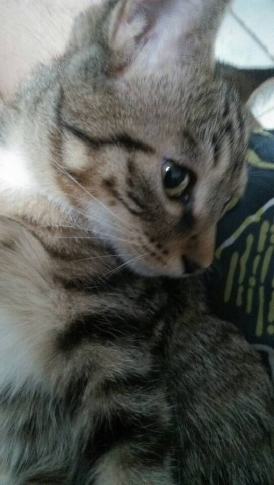

来韩国也买过东西了，吃饭也结帐过了，但是基本都处于拿出钱包到柜台晃晃的样子，今天还是学习一下
韩语的“多少钱”怎么说吧！
哦！对了，今天开始，本站新增一位代言人，哦不，代言喵。隆重欢迎我家可爱的lulu！第一次亮相，侧脸还不赖吧！

 主要内容作者：沪江网校  来源：沪江网校 

<figure >
    
     <figcaption>  </figcaption>
</figure>

敬语形式：

얼마예요? /er ma ye yo / 尔马耶哟

얼마: 多少

常用句型：

(1) 이 것은 얼마예요?  这个多少钱？

(2) 모두 얼마예요? 总共多少钱？

本内容为沪江韩语原创，转载请注明出处，侵权必究。
链接在这[http://kr.hujiang.com/new/p476574/](http://kr.hujiang.com/new/p476574/)

-------------------------------------☞————————↓————————☜
<figure >
    
    <figcaption> 欢迎关注 HowieiBook, 回复“h”查看帮助</figcaption>
</figure>
