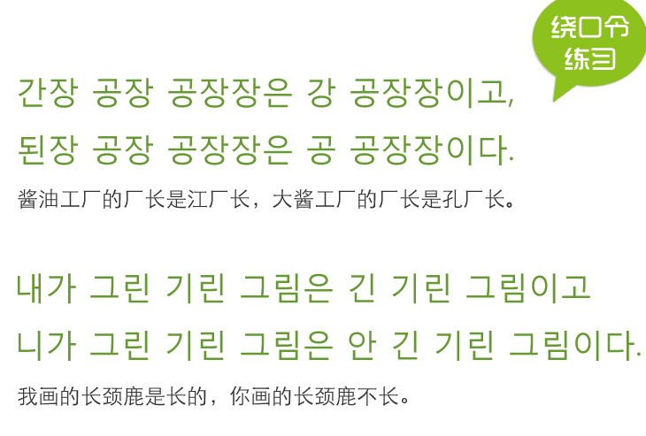
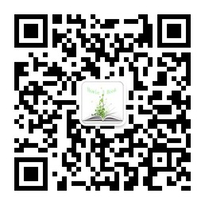

<figure >
    
     <figcaption>  </figcaption>
</figure>

<figure >
    
     <figcaption>  </figcaption>
</figure>

原来韩语也有绕口令哈！
刚才学了一个，第二个有点难，还在练习！

哈哈！
蛮有意思的！

--☞————————↓————————☜
<figure >
    
    <figcaption> 欢迎关注 HowieiBook, 回复“h”查看帮助</figcaption>
</figure>
