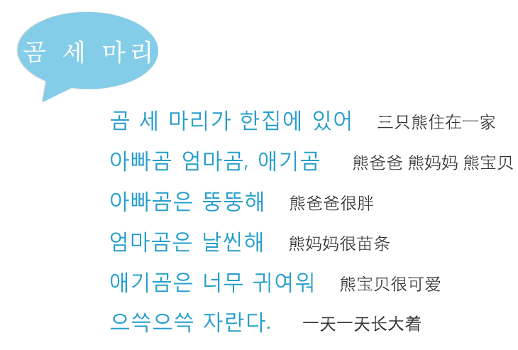

<figure >
    
     <figcaption>  </figcaption>
</figure>

<figure >
    
     <figcaption>  </figcaption>
</figure>

韩语儿歌来啦！

网上一搜一大堆，唱起来还是挺好玩儿的！

顺便复习发音。啊哈！

--☞————————↓————————☜
<figure >
    
    <figcaption> 欢迎关注 HowieiBook, 回复“h”查看帮助</figcaption>
</figure>
