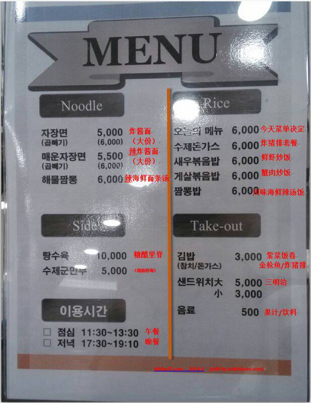

<figure >
    
     <figcaption>  </figcaption>
</figure>

<figure >
    
     <figcaption>  </figcaption>
</figure>

为了避免以后吃饭的麻烦，今天特意花费十多分钟，把公司楼下饭馆的菜单翻译了一下。哈哈！

下次就知道傻是啥了。

<figure >
    
     <figcaption>  </figcaption>
</figure>

--☞————————↓————————☜
<figure >
    
    <figcaption> 欢迎关注 HowieiBook, 回复“h”查看帮助</figcaption>
</figure>
