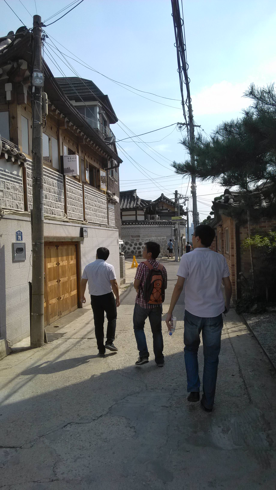
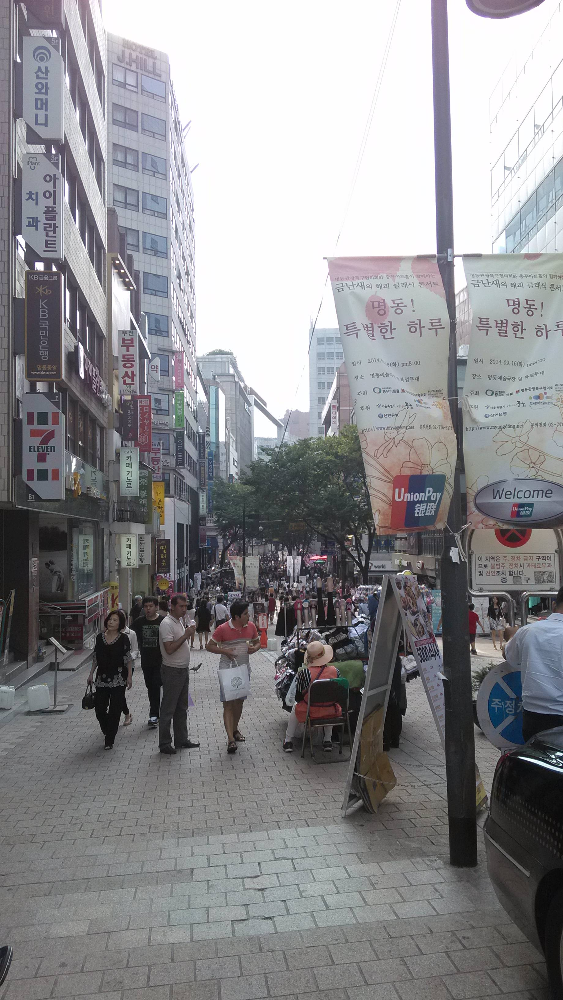

<figure >
    
     <figcaption>  </figcaption>
</figure>

<figure >
    
     <figcaption>  </figcaption>
</figure>

今天和几个小伙伴一起去逛了首尔，主要有以下几个地方：
光化门-景福宫-北村-明洞-东大门；
主要感觉是：依山而建，坡路略多；宫殿简小，不比故宫；商场街道，类似北京。

---

<figure >
    
     <figcaption>  </figcaption>
</figure>

<figure >
    
     <figcaption>  </figcaption>
</figure>

<figure >
    
     <figcaption>  </figcaption>
</figure>

<figure >
    
     <figcaption>  </figcaption>
</figure>

<figure >
    
     <figcaption>  </figcaption>
</figure>

<figure >
    
     <figcaption>  </figcaption>
</figure>
--☞————————↓————————☜
<figure >
    
    <figcaption> 欢迎关注 HowieiBook, 回复“h”查看帮助</figcaption>
</figure>s
