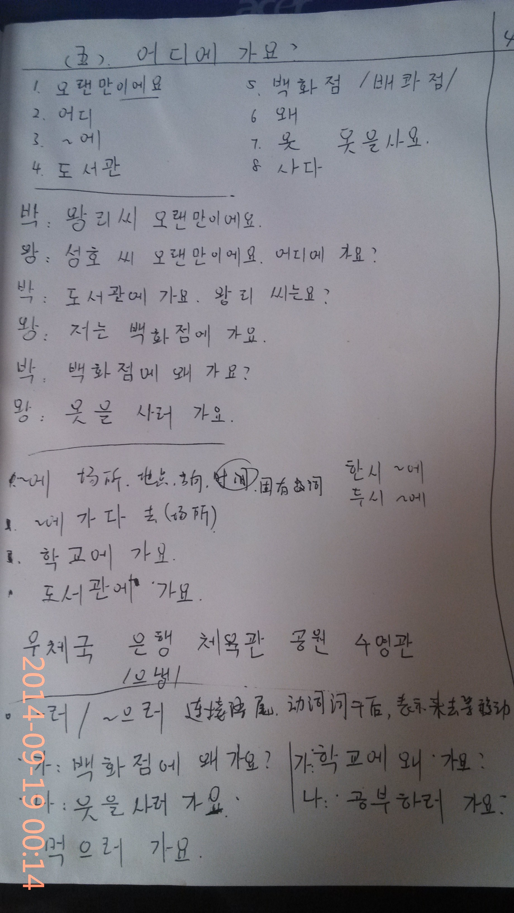
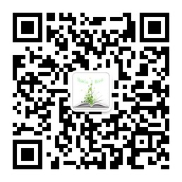

"day-37- 基本会话+语法-您/你去哪"
---
<figure >
    
<figcaption>  </figcaption>
</figure>
正文：

* 你去哪？
* 去图书馆，百货商店神码的？
* 为啥去啊？
* 你猜！

☞————————↓————————☜
<figure >
    
    <figcaption> 欢迎关注 HowieiBook, 回复“h”查看帮助</figcaption>
</figure>
