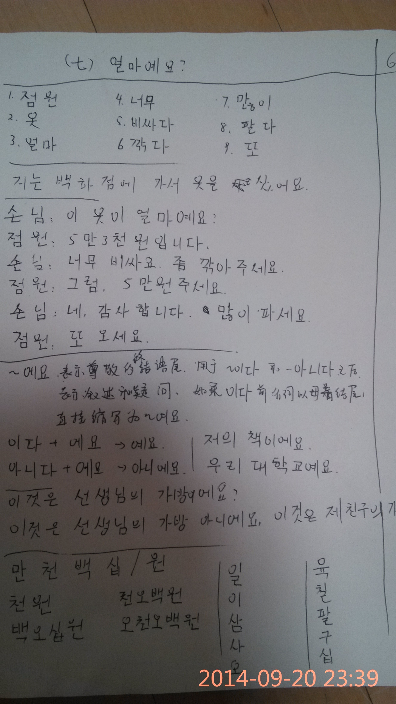

"day-39- 基本会话+语法-砍价啦"
---
<figure >
    
<figcaption>  </figcaption>
</figure>
正文：
今天加上评论的框框了，所以稍微多写几个字吧。
重点还是多少钱的那些固有数词还是要好好记忆一下。现在只能听出来几个数字，起码0-9都要会啊！
今天主要学习了买衣服啥的相关句子：

* 多少钱啊？
* 几万几千多少钱。
* 太贵啦。便宜点呗？
* 那就便宜点，少个几百吧，咋样？
* 恩。那还不错。生意兴隆啊！
* 欢迎再来！

☞————————↓————————☜
<figure >
    
    <figcaption> 欢迎关注 HowieiBook, 回复“h”查看帮助</figcaption>
</figure>
